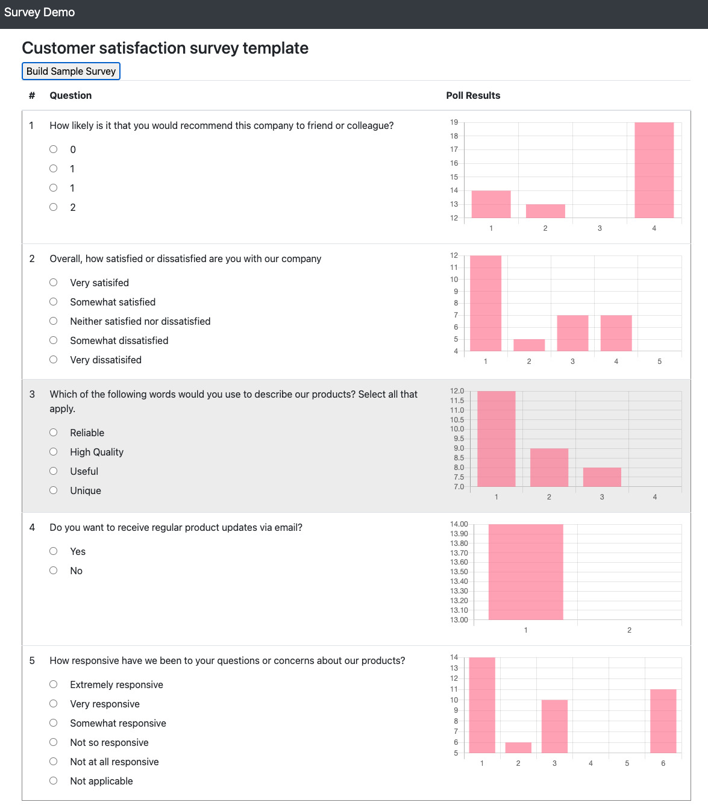

# Run Load tests for serverless applications

## Overview

This article explains an approach to run load tests for serverless application using "[Artillery Core](https://artillery.io/)" (a free & opensource tool used for running performance tests)

## Business usecase

### What is Load testing?

The goal of load testing is to ensure that the architecture and system design works for the amount of traffic expected. It can help developers find bottlenecks and unexpected behavior before we deploy the application to production

### Need for load testing

Here are some of the reasons why execution of load testing is critical:

* Load testing is done to provide stakeholders with information about their application regarding speed, stability, and scalability of application under expected & unexpected load
* Load testing will determine whether their software meets speed, scalability and stability requirements under expected workloads
* Load testing helps to identify the breaking point of the software application

## Artillary

### Introduction

Artillery is a modern, powerful & easy-to-use performance testing toolkit. Use it to ship scalable applications that stay performant & resilient under high load.

You can use Artillery to run two types of performance tests:

* Tests that put load on a system, i.e. load tests, stress tests, and soak tests
* Tests that verify that a system is working as expected, i.e. continuous functional tests, also known by a number of other names such as: synthetic monitoring, semantic monitoring, production scripted testing, and continuous verification. Think ping on steroids - automated probes running continuously against services & APIs to test key user journeys

Artillary can be used to test the following services:

* Artillery is designed for testing backend systems, such as API services, ecommerce backends, chat systems, game backends, databases, message brokers and queues, and anything else that can be communicated with over a network.
* It can be used to test any backend regardless of what protocol it speaks or what language it’s written in. Artillery supports HTTP, WebSocket, and Socket.io out of the box, and many additional protocols such as HLS, Kinesis, and Kafka via plugins. Support for additional protocols can be added via Artillery’s plugin interface.

## Sample application

SurveyTracker - It is a simple three tier application built on top of AWS services that provides following capabilities:

* Create a new survey with a set of question and answers
* Provides a user interface to vote on the survey
* Updates the user interface in real time with the latest vote count for each question in survey

### Architecture

### Target Technology Stack

* AWS Lambda
* AWS API Gateway
* AWS Dynamodb
* AWS S3
* AWS CloudFront
* AWS CloudWatch
* AWS X-Ray

### Target Architecture

Here is the high level architecture of the sample application:


#### Application overview

* The backend service written in Go gets deployed inside AWS Lambda that takes care of reading and writing data to DynamoDb. We expose this lambda function as a REST service using AWS API Gateway.
* Front end application is a static website written in Angular that’s hosted in S3 bucket and made available to public access via AWS CloudFront
* Front end application inside S3 uses API Gateway URL to make any service calls to backend application

#### Dynamodb overview

* Information regarding survey, list of questions, answers and corresponding votes gets stored in `SurveyPoll` DynamoDb table
* Data model for `SurveyPoll` DynamoDb table

| Name  | Description | Sample |
| ----- | ------------- | ----|
| SurveyId | Survey ID (Partition Key) `string` | fec497b1-5783-4063-b03e-9b4ea8bf8532 |
| QuestionId | Question ID (Hash Key) `number` | 0 |
| Question | Survey Question `string` | How many customer projects have you worked on? |
| SurveyName | Survey Name `string` | Customer insights |
| answer_<0..N>_label | Label of answers from 0..N `string` | 1 to 5 |
| answer_<0..N>_vote | Vote for answers from 0..N `number` | 50 |
| ttl | Time to live column | Defaults to 60 mins only for test data created using "Build Sample Survey" button or via API using "recreate=true" flag |

### API Gateway overview

* API Gateway exposes the following REST endpoints

| URL  | Method | Description | Sample request | Sample Response |
| ------------- | ------------- | ----| --- | --- |
| / | POST | Create Survey | `{"name": "surveyName", "questionsAndAnswers": [{"question": "Question", "answers": [{"answer": "Ans1"}, {"answer": "Ans2"} ] } ] }` | fec497b1-5783-4063-b03e-9b4ea8bf8532 |
| /?surveyId=${surveyId} | GET | Get survey data | surveyId | `{"Name":"surveyName","SurveyId":"36702862-daac-4d84-ab0e-b86052674534","QuestionsAndAnswers":[{"Question":"Question","QuestionId":0,"Answers":[{"Answer":"Ans1","AnswerId":0,"Vote":0},{"Answer":"Ans2","AnswerId":1,"Vote":0}]}]}` |
| /?surveyId=${surveyId}&questionId=${questionId}&answerId=${answerId} | PUT | Vote for an answer | answer and question ID | HttpCode: 200 |
| /?recreate=true | POST | Builds a sample survey, test data created which will be automatically deleted after 1 hour | | fec497b1-5783-4063-b03e-9b4ea8bf8532 |

## Build

### Pre-requistes

* AWS SAM CLI needs to get installed, follow the [link](https://docs.aws.amazon.com/serverless-application-model/latest/developerguide/serverless-sam-cli-install.html) to learn how to install them
* Node and NPM needs to get installed, follow the [link](https://docs.npmjs.com/downloading-and-installing-node-js-and-npm) to learn how to install them
* Install Angular CLI by running the following command, you can read more about it [here](https://angular.io/guide/setup-local)

```bash
> npm install -g @angular/cli
```

* Install artillery by running the following command

```bash
> npm install -g artillery
```

* An AWS account with console and API access

* Check out the code from this repository using this command:

```bash
> mkdir load-testing-serverless-apps && cd load-testing-serverless-apps
> git clone https://github.com/hariohmprasath/load-testing-serverless-apps.git .
```

### Front end Build

#### Application Build

* Update `baseUrl` inside [frontend/src/environments/environment.ts](frontend/src/environments/environment.ts) to point to the API gateway URL that we received in the previous step
* Run the below command to build the project using `ng` command from the root directory

```bash
> cd frontend
> npm install
> ng build
```

> All the artifacts gets generated under `frontend/dist/vote-angular-app` folder

#### SAM Build

Run the following command from the root directory

```bash
> cd sam
> sam build
```

### Backend Build

Since SAM build will take care of building, Go module, we require no separate application build. So run the following command from the root directory.

```bash
> cd backend/sam
> sam build
```

### Artillery build

Build the performance testing framework by running the below command from the root directory

```bash
> cd artillery
> npm install
```

## Deployment

### Backend Deploy

Run the following command to deploy the backend application

```bash
> cd sam
> sam deploy --guided
```

> You can either customer or use the default values to run the sam deployment.

API gateway URL will be made an available part of stack output when the deployment is complete

**Output**

```bash
CloudFormation outputs from deployed stack
-----------------------------------------------------------------------------------------------------------------------------------------------------------------------
Outputs
-----------------------------------------------------------------------------------------------------------------------------------------------------------------------
Key                 VoterFunction
Description         Lambda Function ARN
Value               arn:aws:lambda:us-east-1:xxxxx:function:sam-app-SurveyFunction-JPVH1Z7KNANE

Key                 VoterAPI
Description         API Gateway endpoint URL for Prod environment
Value               https://xxxx.execute-api.us-east-1.amazonaws.com/Prod/
------------------------------------------------------------------------------------
```

### Frontend Deploy

#### SAM Backend deploy

Run the following command to deploy the front end stack

```bash
> cd sam
> sam deploy --guided
```

> You can either customer or use the default values to run the sam deployment.

CloudFront Domain name & S3 Bucket ARN will be available in the stack output when the deployment is complete

**Output**

```bash
CloudFormation outputs from deployed stack
-----------------------------------------------------------------------------------------------------------------------------------------------------------------------
Outputs
-----------------------------------------------------------------------------------------------------------------------------------------------------------------------
Key                 CloudFrontURL
Description         CloudFront URL
Value               xxxx.cloudfront.net

Key                 S3Bucket
Description         S3 Bucket ARN
Value               arn:aws:s3:::s3hosting-app-s3bucket-xxxx
-----------------------------------------------------------------------------------------------------------------------------------------------------------------------
```

#### Application backend deploy

* Navigate to `frontend/dist/vote-angular-app` and run the following command

```bash
> aws s3 sync * s3://<<s3-bucket>>
```

> Replace the S3 bucket with the generated S3 bucket name.

## Testing

### API testing

* Import the test case collection under [postman](postman) folder inside the root directory to your postman client.
* The following variables can be customized as part of the collection's properties

| Name  | Description | Sample |
| ----- | ------------- | ----|
| rootUrl | CloudFront Domain Name |  ${your_unique_id}.cloudfront.net |

* Run the testcases in the following order:

1. Create Survey
2. Get Survey (replace the surveyId)
3. Vote (replace the surveyId)
4. Delete
5. Recreate (run this only if you want to delete everything and create a sample survey)

### UI testing

* Navigate to the cloudfront domain and you can see a blank survey application.
* Click on “Build Sample Survey” and wait a couple of seconds so the sample survey gets created. Once its complete the questions gets listed on the UI page.

When everything is successfull, you should see the UI below



### Load testing (using artillery)

#### Scenarios

It’s very important to define the user scenarios and the conditions that need to get met before starting the test. In case of the sample application, the most commonly scenario would be user opening the page, voting on an answer and seeing the live results come through. Running load tests on these scenarios helps to ensure the application will work as expected in case of heavy load.

#### Artillery - Concepts

Based on the user scenario, we create an artillery test definition file [artillery/load-test.yaml](artillery/load-test.yaml). Here are some details which can help you to under the definition file:

**Test definition**

A test definition has two main parts: configuration and one or more scenarios.

1. Configuration is where you define the endpoint(s) on which the system under test can be accessed, define load phases for the test run, load data from external CSV files, configure any plugins etc.
2. Scenarios describe the actions which a virtual user created by Artillery will take

**Load phases and virtual users**

These two concepts are fundamental to how Artillery works, and for being able to use Artillery to its full potential.

1. A load phase tells Artillery how many virtual users to create over a period of time. Load phases is how you model load on a service for the duration of a test run. A load test will usually have multiple load phases, such as a warm up phase, followed by a gentle ramp up phase, which is then followed by one or more heavy load phases. Let’s look at an example:

```yaml
phases:
  - duration: 300
    arrivalRate: 10
    name: Warm up phase
```

This code describes a load phase which lasts 300 seconds (or 5 minutes), where 10 new virtual users will be created every second.

2. A “virtual user” is exactly what the name suggests - a simulation of a real user (or a client) using the service. Each virtual user is completely independent of other virtual users - just like in the real world. For example, when testing an HTTP-based service, each virtual user will open & maintain its own TCP connection(s), will have its own set of cookies if sent by the server etc.

#### Overview of sample test definition file

Test configuration file:

```yaml
config:
  processor: "artillery.js"
  target: "{{ $processEnvironment.URL }}"
  phases:
    - duration: 60
      arrivalRate: 5
      name: Warm up
    - duration: 120
      arrivalRate: 5
      rampTo: 50
      name: Ramp up load
    - duration: 600
      arrivalRate: 50
      name: Sustained load
scenarios:
  - name: "Get Survey and Vote"
    flow:
      - get:
          url: "/?surveyId={{ $processEnvironment.SURVEY_ID }}" # Get questions for survey
          afterResponse: "randomPick" # javascript function to randomly pick a question and answer
          expect:
            - statusCode: 200
            - contentType: json
            - hasProperty: QuestionsAndAnswers
      - put:
          url: "/?surveyId={{ $processEnvironment.SURVEY_ID }}&questionId={{ questionId }}&answerId={{ answerId }}" # Vote on it
          expect:
            - statusCode: 200
  - name: Get Votes
    flow:
      - get:
          url: "/?surveyId={{ $processEnvironment.SURVEY_ID }}" # Get questions and votes          
          expect:
            - statusCode: 200
            - contentType: json
            - hasProperty: QuestionsAndAnswers
```

Out test definition consists of two scenarios:

1. Get all the questions based on `surveyID` and vote on a random question and answer (to simulate a user viewing the screen and voting on it)
2. Get all the questions based on `surveyID` (to simulate user viewing the votes getting updated in realtime)

Each of these scenarios has asserts attached to it with expected `HTTPCode` or a response body from the payload to make sure all the responses are valid

#### Test execution

**Test pre-requisites**

* Run a `HTTP PUT` request to the below mentioned URL to seed a sample which will be used for load testing

```bash
<<APIGateWayURL>>/?recreate=true
```

**Output**

```bash
fec497b1-5783-4063-b03e-9b4ea8bf85323c22fbba908c
```

* Run the following command to `export` or `set` variables, and execute the tests. 

> Note: `export` and `set` command may vary depending upon the operating system in which these commands gets executed.

```bash
> export URL=<<APIGateWayURL>>
> export SURVEY_ID=<<SurverID_from_previous_step>>
> artillery run load-test.yml
```

Here is the sample output of the run:

```bash
Started phase 0 (Warm up), duration: 60s @ 16:47:20(-0800) 2021-03-02
Report @ 16:47:30(-0800) 2021-03-02
Elapsed time: 10 seconds
  Scenarios launched:  49
  Scenarios completed: 46
  Requests completed:  72
  Mean response/sec: 7.68
  Response time (msec):
    min: 132.2
    max: 569.6
    median: 463.2
    p95: 524.6
    p99: 564.3
  Codes:
    200: 72
```

Since we have enabled X-ray for distributed tracing, you can see traces coming in. Here is a screenshot of how it looks like and you see there are no errors reported:


## Cleanup

Run the following command to delete the stack, use the correct stack names if you have changed them during sam deploy

### Frontend cleanup

Run the following command

```bash
aws cloudformation delete-stack --stack-name s3hosting-app
```

### Backend cleanup

```bash
> aws cloudformation delete-stack --stack-name sam-app
```

## Resources

* [Tutorial: Deploying a Hello World application](https://docs.aws.amazon.com/serverless-application-model/latest/developerguide/serverless-getting-started-hello-world.html)
* [Load testing a web application serverless backend](https://aws.amazon.com/blogs/compute/load-testing-a-web-applications-serverless-backend/)
* [Artillery](https://artillery.io/)
* [How do I use CloudFront to serve a static website hosted on Amazon S3](https://aws.amazon.com/premiumsupport/knowledge-center/cloudfront-serve-static-website/)